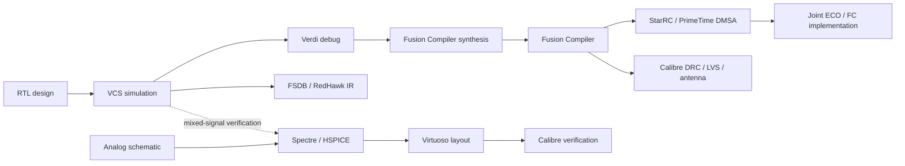

# 芯片设计虚拟机环境及 RTL2GDS

[](https://www.redhat.com/en/technologies/linux-platforms/enterprise-linux)
[](https://www.vmware.com/)
[](#environment-scope)
[](https://github.com/lizhui20/rtl2gds/stargazers)

基于 Red Hat Enterprise Linux 8.10 的芯片设计 VMware 虚拟机环境，面向数字、模拟和数模混合集成电路设计。项目提供预配置虚拟机的下载入口、可复现的导入步骤、环境核验与故障排查文档，并记录已在虚拟机中实现的 RTL2GDS Flow。

> This repository documents a preconfigured VMware environment for digital, analog, and mixed-signal IC design. See [README_EN.md](README_EN.md) for the English guide.

## 功能削减版脚本与使用声明

仓库提供 [rtl2gds_small](rtl2gds_small/README.md) 功能削减版脚本，包含 `be_env` 和 `pr_env`。该目录不代表下文完整虚拟机环境中展示的全部流程与能力，也不包含测试设计、运行产物、EDA 软件或 PDK。

**整个虚拟机环境及脚本仅供学习使用，禁止商用。** 项目自有且许可人有权许可的脚本、配置和文档适用 [LICENSE](LICENSE)，声明摘要见 [NOTICE.md](NOTICE.md)。第三方内容仍受各自许可约束。

## Download

| 下载源 | 链接 | 提取码 |
| --- | --- | --- |
| 百度网盘 | [打开分享](https://pan.baidu.com/s/1wqB7OsjWHtzFlZPJBeHAaQ?pwd=ekdi) | `ekdi` |

网盘当前包含 `RedHat8.10/` 虚拟机目录和 `虚拟机使用方法.docx`。核心磁盘 `RHEL8_ICA-disk1.vmdk` 约为 **389 GB（362 GiB）**；请使用网盘客户端完整下载，并至少预留 **500 GiB** 可用空间。虚拟磁盘的配置容量为 1 TB。

下载链接由第三方网盘托管，失效或文件不完整时请[提交 Issue](https://github.com/lizhui20/rtl2gds/issues/new/choose)，不要从未知来源获取修改版镜像。

## Quick Start

1. 安装支持 OVF/VMX 的 VMware Workstation、VMware Player 或 VMware Fusion。
2. 完整下载 `RedHat8.10/`，保持目录内文件名和相对位置不变。
3. 优先导入 `RedHat8.10.ovf`；导入失败时，直接打开 `RHEL8_ICA.vmx`。
4. 按宿主机能力分配资源。镜像原始配置为 **32 GB 内存、12 vCPU、1 TB 虚拟磁盘、NAT 网络**。
5. 让 VMware 为新实例生成唯一 MAC 地址，不要复用分享指南中的固定值。
6. 启动虚拟机，选择镜像中的默认用户；初始登录信息见网盘附带的 `虚拟机使用方法.docx`，登录后立即修改密码。
7. 使用前，打开终端运行 `lmg`。

详细步骤、宿主机要求和首次启动检查见[快速开始](docs/QUICKSTART.md)。

> [!IMPORTANT]
> 当前网盘附带指南中披露了默认密码和固定 MAC。维护者应轮换密码并重新发布不含共享硬件标识的镜像；完成前仅在 NAT 或隔离网络中启动，且不要复用指南中的 MAC。

## RTL2GDS Flow

以 **`spi_slave` + TSMC 28HPC+（N28）** 为数字实例，串联 RTL 仿真、静态检查、FC 综合、DFT/ATPG、布局布线、StarRC 提取、PrimeTime、Formality、Calibre 和 RedHawk，形成从 RTL 到 GDS 的工程流程。

### 项目亮点

- **统一工程入口**：`gmake <target> b=<design>` 连接 `be_env`、`pr_env` 和 `vcs_sim`，支持阶段重跑、GUI 调试和按设计管理产物。
- **三模式约束贯通**：BE 分别运行功能、扫描移位和扫描捕获 PT，输出三份完整 SDC，由 PR 软链接并用于 MCMM、STA 和 ECO。
- **十二场景时序分析**：三模式 × 四个 SS/FF 温度与寄生组合；PnR 加入 TT 功耗角，共 13 场景，PT GUI 可同时查看十二场景路径。
- **PT 联合 ECO**：DMSA 联合求解 setup/hold，导出独立 `eco.tcl`，FC 完成应用、合法化与 ECO 布线。
- **DFT 时序回放**：扫描插链、ATPG、STIL 转换和带 SDF 的布局后 VCS 回放串联，现有结果为 **205 patterns、0 mismatch**。
- **物理验证与四角 IR**：GDS merge、dummy fill、DRC/LVS/antenna、FM 和活动驱动的 RedHawk static/dynamic 分析。
- **配置与结果管理**：矩形/L 形 floorplan、IO、Vt、CTS、DFT、ECO 和 IR 参数集中设置，配合逐场景报告、输入指纹及完成检查。

### GDS 实图


### 十二场景 PT GUI


图中功能、扫描移位、扫描捕获的十二个场景集合均显示 `NVP=0`、`WNS=0.000`、`TNS=0.000`。工程同时记录了 PnR Formality 等价通过、Calibre LVS `CORRECT`、四角 IR 分析和 **59 项工程回归测试通过**。

[查看完整 RTL2GDS 流程与命令](docs/RTL2GDS.md) · [查看各阶段截图](docs/RTL2GDS_ARCHIVE_2026-09-04.md) · [下载初版 DOCX](docs/RTL2GDS.docx)

项目还展示基于 **SMIC 0.18µm RF** 的 **14-bit、10 MS/s TI SAR ADC** 原理图、版图与后仿案例，覆盖数字、模拟和混合信号设计工作流。

## Environment Scope

已在当前虚拟机的 `/opt` 安装树和 `PATH` 中核验到以下商业 EDA 软件：

| 厂商 | 已检测产品 | 安装版本/发行目录 |
| --- | --- | --- |
| Cadence | Virtuoso IC、Spectre、Liberate | IC 23.1、Spectre 24.1、Liberate 23.1 |
| Synopsys | VCS、Verdi、HSPICE、Design Compiler、Formality、Fusion Compiler、PrimeTime、Library Compiler | 主要为 W-2024.09-SP1 / SP3 |
| Synopsys | SpyGlass、TestMAX、VC Static、StarRC、PrimePower RTL、RTL Architect、WaveView | W-2024.09 系列；另有 StarRC U-2022.12-SP5-2 |
| Siemens EDA | Calibre、Tessent STILVerify | 2025.1_16.10、Tessent 2025.4 |

这些安装覆盖 RTL 仿真与调试、综合与形式验证、静态时序与功耗、数字实现、SPICE 仿真、模拟版图及物理验证等工作流。当前表格记录已检测到的安装目录，具体模块状态以虚拟机内的实测结果为准。



当前虚拟机内部已经确认 RHEL 8.10、VMware 虚拟硬件和上述安装目录。数字流程采用 N28 工艺配置，具体阶段、输入输出和运行命令见 [RTL2GDS 文档](docs/RTL2GDS.md)。

进入虚拟机后运行：

```bash
git clone https://github.com/lizhui20/rtl2gds.git
cd rtl2gds
bash scripts/collect-environment.sh
```

脚本会生成 `environment-report.txt`，记录系统信息、产品发行目录和可执行文件路径。提交报告前仍应人工检查。详见[环境清单](docs/ENVIRONMENT.md)。

## Verified Package Layout

```text
RedHat8.10/
├── RedHat8.10.ovf
├── RedHat8.10.mf
├── RHEL8_ICA.vmx
├── RHEL8_ICA.vmxf
├── RHEL8_ICA.vmsd
├── RHEL8_ICA-file1.nvram
├── RHEL8_ICA-disk1.vmdk       # 389 GB / 362 GiB
└── VMware runtime log files

虚拟机使用方法.docx
```

目录中的部分 VMware 遗留文件名包含 `Red Hat Enterprise Linux 8.9 64`。这不等同于虚拟机当前操作系统版本；启动后请用以下命令核验：

```bash
cat /etc/redhat-release
cat /etc/os-release
```

若输出并非 Red Hat Enterprise Linux 8.10，请提交 Issue，并附上命令输出但不要附带个人信息。

## Documentation

- [快速开始](docs/QUICKSTART.md)
- [RTL2GDS Flow 记录（在线查看）](docs/RTL2GDS.md) · [DOCX 下载](docs/RTL2GDS.docx)
- [环境与工具清单](docs/ENVIRONMENT.md)
- [故障排查](docs/TROUBLESHOOTING.md)
- [发布与脱敏检查表](docs/RELEASE_CHECKLIST.md)
- [贡献指南](CONTRIBUTING.md)
- [安全报告](SECURITY.md)

## Contributing

欢迎提交经过验证的兼容性信息、工具版本清单、启动问题修复和文档改进。请勿在 Issue、日志或 Pull Request 中发布账号信息、私钥、客户设计或其他敏感材料。

如果这个环境节省了你的搭建时间，可以 Star 仓库并在 Issue 中反馈宿主机平台、VMware 版本和已验证工作流；可复现的实测信息比简单转发更有价值。
