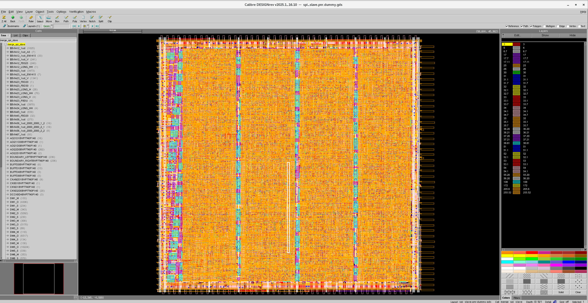
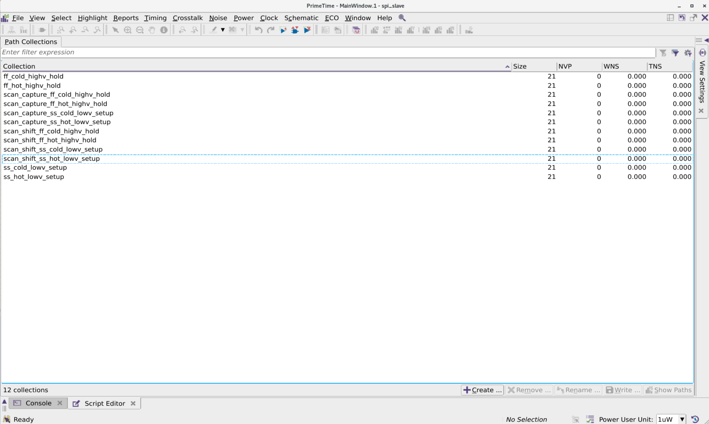

# IC Design Virtual Machine Environment and RTL2GDS

A preconfigured Red Hat Enterprise Linux 8.10 VMware environment for digital, analog, and mixed-signal IC design. The repository provides the image download location, import instructions, environment inventory tooling, troubleshooting notes, and a record of the RTL2GDS flow implemented in the VM.

## Download

Download from [Baidu Netdisk](https://pan.baidu.com/s/1wqB7OsjWHtzFlZPJBeHAaQ?pwd=ekdi) with extraction code `ekdi`.

The shared package currently contains the `RedHat8.10/` VM directory and a Chinese usage guide. The main `RHEL8_ICA-disk1.vmdk` file is about **389 GB (362 GiB)**. Use the Netdisk client for a complete download and reserve at least **500 GiB** of free host storage. The virtual disk is provisioned as 1 TB.

## Start The VM

1. Install a VMware product that can import OVF or open VMX files.
2. Download the complete `RedHat8.10/` directory without renaming or moving individual files.
3. Import `RedHat8.10.ovf`. If import fails, open `RHEL8_ICA.vmx` directly.
4. The source configuration uses 32 GB RAM, 12 vCPUs, a 1 TB virtual disk, and NAT networking.
5. Let VMware generate a unique MAC address for the new instance instead of reusing the fixed value in the shared guide.
6. Start the VM and select its default user. Initial login details are in the bundled Chinese guide; change the password immediately after login.
7. Before use, open a terminal and run `lmg`.

The bundled guide discloses a default password and fixed MAC. The maintainer should rotate the password and republish a sanitized image. Until then, boot only on NAT or an isolated network and do not reuse the guide's MAC value.

## RTL2GDS Flow

The digital example uses **`spi_slave` and TSMC 28HPC+ (N28)**, with 7-track standard cells and a 9-metal 4X2Y2R stack. The project connects RTL simulation, static checks, synthesis, DFT/ATPG, place and route, parasitic extraction, timing analysis, ECO, physical verification, and power integrity analysis.

- **One command interface:** `gmake <target> b=<design>` across `be_env`, `pr_env`, and `vcs_sim`, with per-design outputs and stage recovery.
- **Three-mode constraints:** BE PrimeTime exports separate functional, scan-shift, and scan-capture SDCs; PR links them into MCMM, STA, and ECO.
- **12 timing scenarios:** three modes across four SS/FF PVT and parasitic combinations. PnR retains an additional TT power scenario, for 13 scenarios in total.
- **Joint PrimeTime ECO:** DMSA solves setup/hold across the scenarios and exports `eco.tcl`; Fusion Compiler applies the changes, legalizes placement, and performs ECO routing.
- **DFT timing replay:** scan insertion, ATPG, STIL-to-Verilog conversion, and post-layout VCS replay with SDF. The recorded replay completed **205 patterns with zero mismatches** and timing checks enabled.
- **Physical verification and IR:** GDS merge, dummy fill, Calibre DRC/LVS/antenna, Formality, and four-corner RedHawk static/dynamic IR using gate-level FSDB activity.
- **Engineering controls:** configurable rectangular/L-shaped floorplans, IO, Vt, CTS, DFT, ECO, and activity settings; input fingerprints, stage checks, and **59 passing regression tests**.

### GDS Layout



### 12-Scenario PrimeTime GUI



The 12 displayed collections show `NVP=0`, `WNS=0.000`, and `TNS=0.000`. The project also records successful PnR formal equivalence, a Calibre LVS `CORRECT` result, and four-corner IR analysis.

[Complete workflow and commands](docs/RTL2GDS.md) · [Stage screenshot gallery](docs/RTL2GDS_ARCHIVE_2026-09-04.md) · [Initial DOCX archive](docs/RTL2GDS.docx)

The VM also includes the schematic, layout, and post-layout simulation example of a **14-bit, 10 MS/s TI SAR ADC** using **SMIC 0.18µm RF**, demonstrating analog and mixed-signal design alongside the N28 digital flow.

## Verify The Environment

Some legacy VMware filenames mention Red Hat Enterprise Linux 8.9. Verify the guest version instead of relying on the VM display name:

```bash
cat /etc/redhat-release
cat /etc/os-release
```

To collect a reviewable environment inventory:

```bash
git clone https://github.com/lizhui20/rtl2gds.git
cd rtl2gds
bash scripts/collect-environment.sh
```

See the [Chinese quick-start guide](docs/QUICKSTART.md), [environment inventory](docs/ENVIRONMENT.md), and [troubleshooting guide](docs/TROUBLESHOOTING.md) for details.

The current VM has installation trees for Cadence IC 23.1, Spectre 24.1, Liberate 23.1; multiple Synopsys W-2024.09 products including VCS, Verdi, HSPICE, Design Compiler, Formality, Fusion Compiler, PrimeTime, SpyGlass, TestMAX, StarRC, and VC Static; and Siemens Calibre 2025.1. Product paths have been detected; workflow validation is tracked separately.
