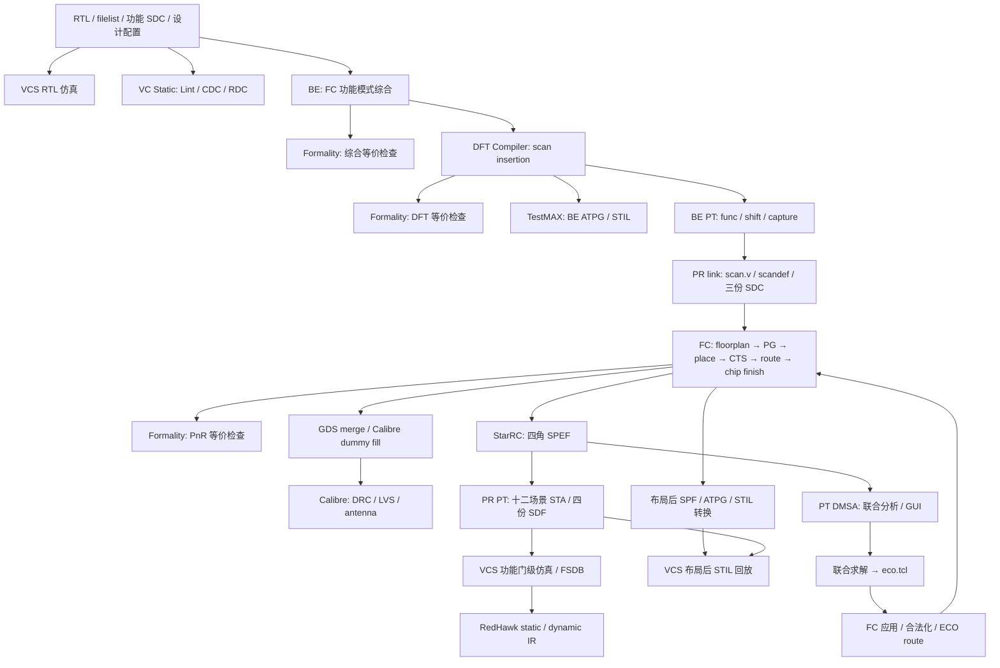

# RTL2GDS 全流程：从 RTL 到 GDS

这套工程以 **`spi_slave` + TSMC 28HPC+（N28）** 为数字设计实例，把 RTL 仿真、静态检查、综合、DFT、布局布线、时序分析、ECO、物理验证和电源完整性分析组织成一套统一的 Make/Tcl 流程。

采用 7-track 标准单元与 9 层金属 4X2Y2R，前端 `be_env`、后端 `pr_env`、仿真 `vcs_sim` 按设计名交接数据。既能执行整段流程，也能单独重跑一个阶段并打开 GUI 调试。

## 1. 先看结果

### GDS 版图


`spi_slave.pnr.dummy.gds` 在 Calibre DESIGNrev 中打开，展示标准单元、时钟与信号布线、电源结构和 dummy fill。合并后的版图顶层为 `merge_spi_slave`。

### 十二场景 PrimeTime GUI


功能、扫描移位、扫描捕获三种模式分别展开四个 PVT/寄生组合，GUI 同时显示 **12 个场景集合**。图中各集合 `NVP=0`、`WNS=0.000`、`TNS=0.000`，可以在同一窗口切换并定位不同模式、不同角的路径。

| 项目结果 | 记录 |
| --- | --- |
| BE 三模式 PT | `func / scan_shift / scan_capture` 各自完成分析，setup/hold 为 0 |
| PR 十二场景 STA | setup/hold 汇总为 0，max-transition、max-capacitance、max-fanout 违例为 0 |
| 布局后 ATPG 回放 | 205 个 pattern，0 skipped、0 mismatch，开启时序检查 |
| 布局后 ATPG 覆盖率 | test coverage 97.00%；BE ATPG 为 201 个 pattern、97.12% |
| Formality | PnR 等价检查 `Verification SUCCEEDED` |
| Calibre LVS | 比较结果 `CORRECT` |
| Antenna | antenna 与 MIM antenna 报告的结果数均为 0 |
| RedHawk | 四个角完成 static/dynamic IR 分析，活动 net/input coverage 均为 100% |
| 工程回归 | 59 项脚本测试通过；独立小设计的 PT 联合 ECO 将受控 hold 违例从 4 修复到 0 |

数据来自 2026-09-05 整理的工程报告与截图，汇总见[结果记录](evidence/2026-09-05-summary.json)。

## 2. 项目亮点

### 一套入口串联多种 EDA 工具

使用 `gmake <target> b=<design>` 统一选择设计和阶段。BE、PR、VCS 各自维护设计目录，网表、约束、扫描信息、SPEF、SDF 和 FSDB 按固定位置交接。

### 功能与 DFT 三模式约束贯通

FC 在功能模式完成综合，BE PT 分别运行正常功能、扫描移位和扫描捕获，导出 **三份完整 SDC**。PR 软链接这些约束，通过模式清单建立 MCMM 场景，实现综合、DFT、PnR、STA 和 ECO 的约束衔接。

### 十二场景 STA 与统一 GUI

**3 种模式 × 4 个工艺/寄生组合 = 12 个时序场景**。PnR 再保留一个 TT 功耗场景，共 13 个场景。StarRC 四角寄生参数、PT 场景选择和模式约束统一组织；IMSA GUI 可以同时加载全部场景的路径集合。

### PT 联合 ECO，FC 完成物理实现

PT DMSA 联合所有场景求解 setup/hold，输出独立 **`eco.tcl`**，包含具体的单元尺寸调整、缓冲器插入和连接命令。FC 核对输入网表后执行修改、合法化和 ECO 布线，再进入提取与验证流程。

### DFT 从插链走到带 SDF 的回放

DFT Compiler 插链，TestMAX 生成 pattern，Tessent STILVerify 转换为 Verilog，VCS 执行移位、捕获、卸载与期望值比对。布局后重新生成 SPF/ATPG，配合最终网表及 SDF 完成 205 个 pattern 的时序回放。

### 物理签核与活动驱动的四角 IR

集成 GDS merge、Calibre dummy fill、prefill/postfill DRC 与 LVS、antenna、Formality 和 StarRC。RedHawk 使用真实门级 FSDB，自动检查活动覆盖率并分析四个角的静态和动态压降。

### 工程化管理，方便重跑与迁移

工艺、库、Vt、CTS、floorplan、DFT 和 IR 参数集中配置；支持矩形/L 形 floorplan、设计覆盖文件和按阶段恢复。日志与报告按设计、阶段、模式和场景分层保存，输入指纹和完成检查用于管理重跑后的结果。

## 3. RTL 到 GDS 的数据流



## 4. 工程结构与工具分工

```text
Project/
├── DESIGN/          # RTL、filelist、功能 SDC、设计覆盖配置
├── be_env/          # RTL 检查、综合、DFT、ATPG、三模式 PT/FM
├── pr_env/          # PnR、提取、签核、DMSA/ECO、布局后 ATPG、IR
├── vcs_sim/vcs/     # RTL、功能门级、BE/PR ATPG 编译与仿真
└── flow_tools/      # BE/PR 共享的状态与结果检查
```

| 工具 | 在工程中的任务 |
| --- | --- |
| VCS / Verdi | RTL 和门级仿真、波形生成与调试 |
| VC Static | Lint、CDC、RDC |
| Fusion Compiler | 功能模式综合、MCMM PnR、ECO 实现、GDS 导出 |
| DC NXT / DFT Compiler | 扫描链插入、DFT 检查和协议生成 |
| TestMAX / Tessent STILVerify | ATPG、STIL 处理与 Verilog pattern 转换 |
| Formality | 综合、DFT、PnR 等价检查 |
| StarRC / PrimeTime | 四角提取、静态时序分析、DMSA、联合 ECO |
| Calibre | DESIGNrev、DRC、LVS、antenna、dummy fill |
| RedHawk | 四角 static/dynamic IR 与活动质量检查 |

本仓库提供项目展示、命令说明和截图。以下命令在虚拟机的 `Project/` 工程目录执行。

## 5. BE：综合、DFT、三模式 PT

```bash
# 设计输入及 RTL 仿真
gmake -C be_env run_prepare_inputs b=spi_slave
gmake -C vcs_sim/vcs run_compile run_sim b=spi_slave

# RTL 静态检查、综合与等价验证
gmake -C be_env run_vc_lint run_vc_cdc run_vc_rdc b=spi_slave
gmake -C be_env run_fc_syn b=spi_slave
gmake -C be_env run_fm b=spi_slave

# DFT 插链及等价检查：run_fm_dft 包含 run_dft_insert 前置步骤
gmake -C be_env run_fm_dft b=spi_slave
gmake -C be_env run_atpg b=spi_slave

# 三模式 PT 与三份 SDC 导出
gmake -C be_env run_pt_modes b=spi_slave
```

也可以分别运行：

```bash
gmake -C be_env run_func_pt b=spi_slave
gmake -C be_env run_shift_pt b=spi_slave
gmake -C be_env run_capture_pt b=spi_slave
gmake -C be_env run_mode_pt b=spi_slave PT_MODE=scan_capture
```

| 模式 | SPI 控制条件 | 时序对象 |
| --- | --- | --- |
| `func` | `scan_en=0`、`test_mode=0` | 正常功能路径 |
| `scan_shift` | `scan_en=1`、`test_mode=1`、复位释放 | 扫描串行移位路径及接口 |
| `scan_capture` | `scan_en=0`、`test_mode=1`、复位释放 | 测试模式下的功能组合路径与捕获 |

BE 当前运行 **3 种模式 × SS / 0.81V / 125°C 这 1 个角**，各模式读取同一份 `scan.v`，输出独立 log/report/SDC。原 `run_pt` 保留 mapped 网表与 mapped SDF 的 lib/db/NDM 功能模型导出链。

SPI 的扫描时钟复用 `spi_clk`，扫描输出复用 `miso`。当前 stuck-at 协议为 100ns 周期：输入 0ns 驱动，输出 40ns 比较，时钟在 45/55ns 翻转。移位时选择扫描 SI 支路，捕获时选择功能 D 支路。

## 6. 三份 SDC 如何贯通 PR

```text
BE 功能综合 → mapped.sdc
                  ↓
       BE PT_MODE 选择与模式分析
                  ↓
     func.sdc / scan_shift.sdc / scan_capture.sdc
                  ↓
            pt_modes.tcl 清单
                  ↓
       PR inputs 软链接 → MCMM / STA / ECO
```

BE PT 导出完整模式约束，PR 按场景选择对应 SDC，并加载自己的库角、电压、温度和寄生参数。功能 SDC 来自综合约束，扫描 SDC 根据 SPF 中的测试波形生成。`pnr.sdc` 同时保留为功能约束快照。

```text
be_env/spi_slave/
├── results/spi_slave.{func,scan_shift,scan_capture}.sdc
├── results/spi_slave.pt_modes.tcl
├── logs/run_func_pt.log
├── logs/run_shift_pt.log
├── logs/run_capture_pt.log
└── reports/pt/{func,scan_shift,scan_capture}/
```

## 7. PR：布局布线、物理验证与 GDS

```bash
gmake -C pr_env link b=spi_slave
gmake -C pr_env smoke b=spi_slave
gmake -C pr_env pnr_all b=spi_slave
gmake -C pr_env signoff_all b=spi_slave
```

| 阶段 | 目标 | 主要工作 |
| --- | --- | --- |
| 平面规划 | `run_floorplan` | die/core、参考库、模式/角与 pin 规划 |
| 电源网络 | `run_power_mesh` | ring、mesh、rail 与 PG 连接 |
| 放置 | `run_place` | 标准单元放置、scan-aware 优化 |
| 时钟树 | `run_cts` | CTS、时钟路径和传播延迟控制 |
| 布线 | `run_route` | 信号/时钟布线、时序与电气优化 |
| 收尾 | `run_chip_finish` | filler、最终网表/DEF/SDC/SVF |
| 等价验证 | `run_fm` | scan 与最终 PnR 网表比较 |
| 版图交付 | `run_merge_gds`、`run_dummy_fill` | GDS 合并与 Calibre dummy fill |
| 物理验证 | DRC / LVS prefill、postfill、antenna | 填充前后独立检查 |
| 寄生与时序 | `run_extract_spef`、`run_pt_signoff` | StarRC 四角 SPEF 与十二场景 STA |

`pnr_all` 包含 PnR 各阶段及 FM。`signoff_all` 串联：

```text
metal fill → FC DRC/LVS → GDS merge → SPEF
→ LVS source → prefill DRC/LVS → dummy fill → postfill DRC/LVS → antenna
→ PT signoff → 布局后 SPF → 布局后 ATPG → STIL 转换
```

NDM 按阶段保存 block label，便于恢复和 GUI 调试。行 filler、FC metal fill 和 Calibre dummy fill 分别由各自配置控制；当前 N28 默认使用 Calibre dummy fill。

## 8. 十二场景 STA 与 GUI

下表四个组合分别扩展到 `func`、`scan_shift`、`scan_capture`：

| 基础场景 ID | PVT | SPEF | 主要检查 |
| --- | --- | --- | --- |
| `ss_hot_lowv_setup` | SS / 0.81V / 125°C | `cworst_125` | setup |
| `ss_cold_lowv_setup` | SS / 0.81V / −40°C | `cworst_m40` | setup |
| `ff_hot_highv_hold` | FF / 0.99V / 125°C | `cbest_125` | hold |
| `ff_cold_highv_hold` | FF / 0.99V / −40°C | `cbest_m40` | hold |

扫描场景名称在基础 ID 前增加 `scan_shift_` 或 `scan_capture_`。四份 SPEF 由三种模式复用；PnR 额外保留 TT / 0.90V / 25°C 功耗场景。

```bash
# 逐场景签核报告与 SDF
gmake -C pr_env run_pt_signoff b=spi_slave

# DMSA 联合分析与全部场景 GUI
gmake -C pr_env run_pt_dmsa b=spi_slave
gmake -C pr_env pt_gui b=spi_slave

# 恢复指定场景的完整分析环境
gmake -C pr_env pt_gui b=spi_slave PT_SCENARIO=scan_shift_ff_cold_highv_hold
```

默认 GUI 加载全部场景的路径快照，单场景入口恢复完整 session。逐场景报告保存在 `reports/signoff/pt/scenarios/<scenario>/`；根目录保留 setup、hold、约束与电气违例汇总。四份 SDF 位于 `results/signoff/sdf/`，供门级和扫描时序回放使用。

## 9. PT 联合 ECO 与 FC 修复

```bash
# PT 联合求解并导出独立 eco.tcl
gmake -C pr_env run_pt_eco b=spi_slave
gmake -C pr_env pt_eco_gui b=spi_slave

# FC 应用、合法化与 ECO 布线
FC_AUTO_EXIT=1 gmake -C pr_env run_apply_pt_eco b=spi_slave

# 更新实现交付与签核报告
FC_AUTO_EXIT=1 gmake -C pr_env run_chip_finish run_fm b=spi_slave
gmake -C pr_env signoff_all b=spi_slave
```

| ECO 入口 | 修复方式 |
| --- | --- |
| `run_pt_eco` | PT DMSA 联合 setup/hold 求解，导出单元尺寸调整、插入与连接命令 |
| `run_apply_pt_eco` | FC 核验输入基准、执行 `eco.tcl`、合法化和 ECO route |
| `run_setup_fix_eco` | FC `route_opt` 优化 setup |
| `run_hold_fix_eco` | 根据 PT hold 汇总或显式目标插入配置的延迟单元 |
| `run_electrical_fix_eco` | 处理最大转换时间、电容、扇出，进行驱动调整与负载拆分 |
| `electrical_eco_all` | 电气修复、交付更新、FM、提取、物理检查和 PT 批处理 |

DMSA 与联合 ECO 位于 PR。`run_pt_eco` 重新建立全部场景、计算具体修复方案，并保存 before/after 报告与 session；FC 实现后再进行寄生提取和时序复核。

```text
results/signoff/pt_dmsa/
├── sessions/before/<scenario>/
└── paths/before/<scenario>/

results/signoff/pt_eco/
├── sessions/{before,after}/<scenario>/
├── paths/{before,after}/<scenario>/
└── eco.tcl
```

当前 SPI 快照没有待修复 setup/hold，生成无需修改的脚本；独立小设计测试则验证了非空 ECO：PT 在目标扫描输入插入延迟单元，将 4 条受控 hold 违例修复为 0。

## 10. 功能后仿真与 STIL 回放

| 仿真 | 激励 | 主要任务 |
| --- | --- | --- |
| RTL 仿真 | 功能 testbench | 检查 RTL 功能与接口行为 |
| 功能门级后仿真 | 功能 testbench + 网表/SDF | 检查实现后的功能与配置的时序行为，生成 FSDB |
| BE ATPG 回放 | scan 网表 + ATPG pattern | 检查 scan protocol 与 pattern 逻辑 |
| 布局后 STIL 回放 | 最终网表 + SDF + 布局后 pattern | 检查移位、捕获、卸载、期望值和时序 |

```bash
# 功能门级编译与仿真
gmake -C vcs_sim/vcs run_gate_compile run_gate_sim b=spi_slave

# PR 生成布局后 pattern，并转换为 Verilog
FC_AUTO_EXIT=1 gmake -C pr_env prepare_atpg_postlayout b=spi_slave
gmake -C pr_env run_atpg_postlayout b=spi_slave
gmake -C pr_env run_postlayout_stil_to_verilog b=spi_slave

# VCS 布局后编译与时序回放
gmake -C vcs_sim/vcs run_postlayout_atpg_compile b=spi_slave
gmake -C vcs_sim/vcs run_postlayout_atpg_sim b=spi_slave
```

布局后 ATPG 默认使用 SS/MAX SDF 并开启时序检查，现有结果为 **205 patterns、0 skipped、0 mismatch**。转换步骤按设计复位配置生成 `.sim.stil`，保留原 ATPG pattern；时序库、网表、SDF 和向量通过编译输入指纹关联。

普通 gate 默认入口用于功能验证和 FSDB 生成；其时序检查开关、SDF 角及 min/max 选择在 `vcs_sim/vcs/config.mk` 配置，并写入运行记录。仿真结果集中在 `out/<design>/` 下。

## 11. RedHawk 四角 static / dynamic IR

```bash
# 已有最终布局输入和门级 FSDB 后
gmake -C pr_env redhawk_all b=spi_slave

# 分别执行或查看结果
gmake -C pr_env run_redhawk_static b=spi_slave
gmake -C pr_env run_redhawk_dynamic b=spi_slave
gmake -C pr_env redhawk_gui b=spi_slave REDHAWK_GUI_MODE=dynamic REDHAWK_GUI_CORNER=tt0p8v85c
```

| 分析角 | static 最差压降 | dynamic 最差压降 |
| --- | --- | --- |
| TT / 0.80V / 85°C | 0.012500% | 0.887500% |
| TT / 0.90V / 85°C | 0.011111% | 0.900000% |
| FF / 0.88V / 125°C | 0.034091% | 1.340909% |
| FF / 0.99V / 125°C | 0.040404% | 1.515152% |

四角使用真实 gate FSDB、RVT/HVT/LVT APL 模型，并记录供电压降、ground bounce、活动覆盖率与 idle-net 比例。分析频率、活动窗口和电压预算在设计配置中统一管理。

## 12. 状态管理与交付物

```bash
gmake -C be_env status b=spi_slave
gmake -C pr_env status b=spi_slave
gmake -C pr_env pnr_status b=spi_slave
gmake -C pr_env signoff_status b=spi_slave
```

每一步开始时更新 `.start`，完成日志与产物检查后写入 `.done`。`status` 只读核验现有记录；批处理递归检查组成阶段。`begin_*` 是 Make 内部记录步骤，常规使用直接运行对应业务目标即可。

| 目录 | 内容 |
| --- | --- |
| `inputs/` | filelist、SDC、设计配置、handoff 软链接 |
| `ref/`、`tech/` | 参考库、工艺、RC 视图链接 |
| `work/` | 各工具运行目录 |
| `logs/` | 按阶段组织的工具日志和完成标记 |
| `reports/` | QoR、STA、DFT、FM、DRC/LVS、IR 报告 |
| `results/` | NDM、网表、DEF、GDS、SDC、SPEF、SDF、STIL、ECO Tcl |

新增设计通过 `b=<design>`、RTL/filelist、功能 SDC、DFT 参数和 PR 覆盖配置接入。矩形/L 形 floorplan、IO、Vt、CTS、ECO 单元和 IR 活动参数均可配置，便于在同一工程框架内组织多个设计。

## 13. 更多截图与模拟案例

[查看综合、DFT、Formality、RedHawk、RVE 等阶段截图](RTL2GDS_ARCHIVE_2026-09-04.md) · [下载初版 DOCX](RTL2GDS.docx)


项目还包含 **14-bit、10 MS/s TI SAR ADC** 案例，使用 **SMIC 0.18µm RF** 工艺，原记录展示了原理图、版图、后仿和 Cadence signoff 流程。数字 SPI/N28 与模拟 ADC/SMIC 两个案例共同展示虚拟机的数字、模拟和混合信号设计能力。
