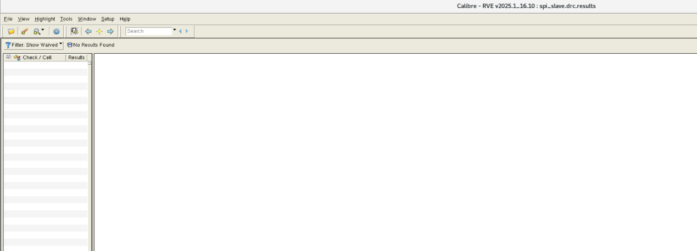

# 芯片设计虚拟机环境及 RTL2GDS

**SMIC 0.18 µm RF 工艺 RTL-to-GDS Flow 示例记录**

本文档记录在 Red Hat 8.10 芯片设计虚拟机环境中实现的 RTL2GDS Flow，并以 `smic18mmrf` 工艺进行示范。记录覆盖逻辑实现、DFT/ATPG、布局布线、形式验证、静态时序分析、物理验证与 GDS 结果检查。

| 项目 | 内容 |
| --- | --- |
| 示例设计 | `spi_slave` |
| 示范工艺 | `smic18mmrf`（SMIC 0.18 µm RF） |
| 覆盖范围 | RTL 实现、DFT/ATPG、P&R、FM、PT、DRC、LVS、GDS |
| 整理日期 | 2026-08-28 |

> 本文档为运行记录与结果概览；当前 RTL2GDS Flow 脚本以加密形式保存，未在文档中展开。需要离线版本时，可[下载原始 DOCX](RTL2GDS.docx)。

## 1. Flow 概览

整体流程从功能实现与测试结构插入开始，经布局布线和签核阶段生成 GDS，并以形式验证、静态时序分析、DRC/LVS 和 ATPG 结果检查实现闭环。

| 阶段 | 入口/集合 | 主要步骤 |
| --- | --- | --- |
| 逻辑实现与测试 | `fun_fc` + `run_dft` + `run_atpg` | 逻辑实现、DFT 插入、ATPG |
| 布局布线 | `run_pr` | floorplan、power mesh、place、CTS、route、chip finish、FM |
| 签核 | `run_signoff` | metal fill、FC DRC/LVS、GDS merge、SPEF、DRC、antenna、LVS、PT、post-layout ATPG |

阶段命令：

- `run_pr`：`run_floorplan` · `run_power_mesh` · `run_place` · `run_cts` · `run_route` · `run_chip_finish` · `run_fm`
- `run_signoff`：`run_metal_fill` · `run_fc_drc_lvs` · `run_merge_gds` · `run_extract_spef` · `run_drc` · `run_antenna` · `run_lvs` · `run_pt_signoff` · `run_atpg_postlayout`

## 2. 逻辑实现、DFT 与 ATPG

运行 `fun_fc`、`run_dft` 与 `run_atpg` 后，示例设计完成逻辑实现和测试流程。截图记录了最终 QoR、ATPG 覆盖率以及主要输出文件。

*图 1：Compile Fusion 最终 QoR 汇总*

*图 2：ATPG 结果，stuck-at fault test coverage 为 99.91%*

*图 3：逻辑实现、DFT 与 ATPG 阶段输出文件*

## 3. 形式验证（run_fm）

形式验证结果显示 `Verification SUCCEEDED`；截图中 230 个 compare points 全部通过，未出现 failing compare point。

*图 4：Formality 等价性验证结果*

## 4. 静态时序分析（run_pt）

PrimeTime 阶段加载寄生参数并生成 timing、QoR、setup、hold、constraint 等报告，用于签核阶段的时序检查。

*图 5：PrimeTime 报告生成与分析环境*

## 5. 布局布线（run_pr_all）

布局布线流程覆盖 floorplan、供电网络、布局、时钟树、布线和 chip finish，并生成 DEF、GDS、网表、SDC 等交付文件。

*图 6：run_pr_all 生成的主要 P&R 交付文件*

## 6. Signoff 与 GDS

签核流程生成 SPEF、DRC/LVS 结果、antenna 结果和版图相关文件，最终 GDS 可在 Calibre DESIGNrev 中打开检查。

*图 7：Signoff 阶段主要输出文件*

*图 8：spi_slave 最终 GDS 版图视图*

## 7. 物理验证

### 7.1 DRC（run_drc）

Calibre RVE 的 DRC 结果窗口显示未发现结果项。

*图 9：DRC 结果检查*

### 7.2 LVS（run_lvs）

Calibre RVE 的 LVS comparison results 显示顶层单元比对正确。

*图 10：LVS comparison results，CORRECT*

## 8. TI SAR ADC 示例

Project 中还包含一个基于 `smic18mmrf` 工艺实现的 14-bit、10 MS/s TI SAR ADC 示例。该示例已完成后仿，并在 Cadence 环境中走完 signoff 流程。

*图 11：TI SAR ADC 原理图与版图视图*

## 9. 记录范围

本文档保留了原始记录中的全部结果截图，并对标题、流程层级、结果说明和图注进行了统一。截图用于说明该虚拟机环境中的流程实现情况；具体设计参数和复现实验应以实际工程配置为准。
