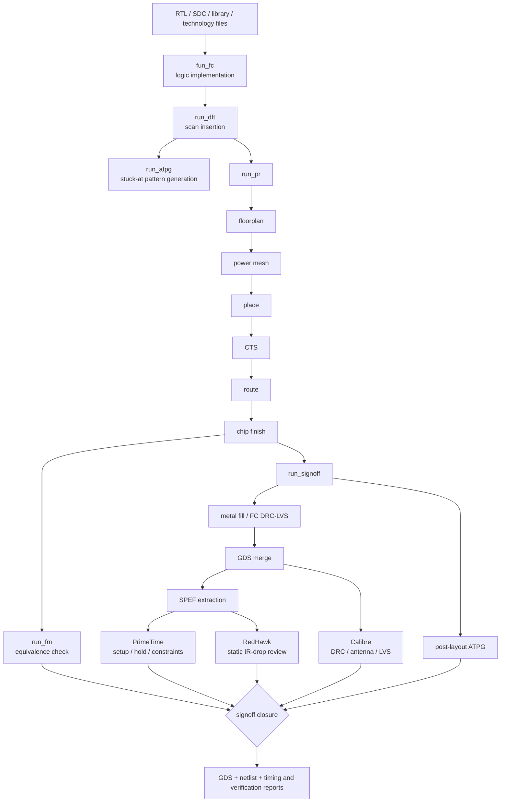

# 芯片设计虚拟机环境及 RTL2GDS

**SMIC 0.18 µm RF 工艺 RTL-to-GDS Flow 示例记录**

本文档记录在 Red Hat 8.10 芯片设计虚拟机环境中实现的 RTL2GDS Flow，并以 `spi_slave` 和 `smic18mmrf` 工艺为例，串联逻辑实现、DFT/ATPG、布局布线、形式验证、寄生参数提取、静态时序与电源完整性分析、物理验证以及 GDS 交付。

| 项目 | 内容 |
| --- | --- |
| 示例设计 | `spi_slave` |
| 示范工艺 | `smic18mmrf`（SMIC 0.18 µm RF） |
| 覆盖范围 | RTL 实现、DFT/ATPG、P&R、FM、SPEF、PT、RedHawk、DRC、antenna、LVS、GDS |
| 整理日期 | 2026-09-04 |

> 本文档是运行记录和结果解读，不是可直接执行的公开脚本。当前 Flow 脚本以加密形式保存，因此这里只记录阶段入口、数据关系、交付物和截图中能够确认的结果。具体 signoff 标准仍应以工程约束、工艺 deck 和项目 waiver 为准。

## 1. 端到端 Flow

| 阶段 | 入口/集合 | 子步骤 | 主要交付物或判断 |
| --- | --- | --- | --- |
| 逻辑实现与测试 | `fun_fc`、`run_dft`、`run_atpg` | 逻辑实现、scan/DFT 插入、ATPG | mapped/scan netlist、SDC、SDF、STIL、覆盖率报告 |
| 布局布线 | `run_pr` | floorplan、power mesh、place、CTS、route、chip finish、FM | routed netlist、DEF、GDS、SDC、FM 结果 |
| 签核 | `run_signoff` | metal fill、FC DRC/LVS、GDS merge、SPEF、DRC、antenna、LVS、PT、post-layout ATPG | merged GDS、SPEF、STA/DRC/LVS/antenna/ATPG 报告 |
| 电源完整性复核 | RedHawk GUI | 载入版图、电源网络与分析结果，查看静态 IR drop | IR 分布和 worst-node 列表；是否通过取决于项目电压预算 |

脚本中已经记录的集合关系：

- `run_pr`：`run_floorplan` → `run_power_mesh` → `run_place` → `run_cts` → `run_route` → `run_chip_finish` → `run_fm`
- `run_signoff`：`run_metal_fill` → `run_fc_drc_lvs` → `run_merge_gds` → `run_extract_spef` → `run_drc` → `run_antenna` → `run_lvs` → `run_pt_signoff` → `run_atpg_postlayout`

RedHawk 截图用于补充签核后的电源完整性结果复核；由于公开记录没有给出其脚本入口名，本文不虚构命令。

## 2. 输入、检查点与交付物

完整运行至少涉及以下几类数据。截图只能证明本次示例运行的界面和结果，不能替代对输入版本的锁定。

| 类别 | 典型内容 | 在 Flow 中的作用 |
| --- | --- | --- |
| 设计输入 | RTL、top 名称、时钟/复位定义 | 逻辑实现与层次构建 |
| 时序约束 | SDC、工作模式、setup/hold 条件 | 综合、P&R 和 PrimeTime 的共同约束基线 |
| 库与工艺 | timing `.lib/.db`、NDM/LEF、technology/RC 数据 | 映射、布局布线、寄生提取和 STA |
| DFT 输入 | scan 配置、test protocol、fault model | scan 插入与 ATPG pattern 生成 |
| 物理签核输入 | GDS/OASIS、版图/源网表、Calibre rule deck | DRC、antenna 和 LVS |
| 电源完整性输入 | 电源网络、版图寄生、供电条件及分析配置 | RedHawk 静态 IR-drop 分析 |

建议把以下项目作为阶段交接门槛：逻辑与约束可读、DFT 规则已审阅、ATPG 覆盖率达到项目目标、P&R 完成且输出齐全、FM 等价、寄生参数成功回标、setup/hold/constraint 收敛、IR drop 满足电压预算、DRC/antenna warning 已分类、LVS 正确，最后再归档 GDS 与报告。

## 3. 逻辑实现、DFT 与 ATPG

### 3.1 逻辑实现（`fun_fc`）

`fun_fc` 完成逻辑映射与优化，并输出 QoR 和后续 DFT/P&R 所需的数据。截图中的 Compile Fusion final QoR 显示 WNS、TNS 与 R2RTNS 均为 `0.0000`，同时列出 leakage、area、instance/buffer/inverter count 等实现统计。工具 message summary 仍包含 warning，交付前应逐条分类，而不能只根据 WNS/TNS 判定阶段完全通过。

*图 1：Compile Fusion 最终 QoR 与 message summary*

### 3.2 DFT 插入与 ATPG（`run_dft`、`run_atpg`）

DFT 阶段生成 scan netlist/test protocol，ATPG 阶段针对 stuck-at fault model 生成 pattern。截图记录了 9,404 个 total faults，其中 9,396 个 detected、8 个 not detected，最终 test coverage 为 **99.91%**，共保存 184 个 pattern。

截图顶部同时保留 `N23` DRC warning：它提示此前的 DFT rule violation 可能使生成的 pattern 在仿真中失败。因此 **99.91% 是覆盖率结果，不等于 pattern 已完成无条件签核**；仍需检查 N23 根因，并通过 pattern simulation 或项目认可的 waiver 闭环。

*图 2：ATPG stuck-at fault summary，test coverage 为 99.91%*

阶段输出目录包含 `.db`、mapped/scan Verilog、SDC、SDF、SVF、SPF、STIL、DEF/LEF、NDM 以及 PrimeTime session 等数据，用于后续 P&R、FM、STA 和测试验证。

*图 3：逻辑实现、DFT 与 ATPG 阶段主要输出文件*

## 4. 布局布线（`run_pr`）

布局布线按以下顺序推进：

1. `run_floorplan`：建立 die/core、IO 与初始布局约束。
2. `run_power_mesh`：构建电源环、stripe/rail 和连接，为后续 IR 分析提供物理基础。
3. `run_place`：完成标准单元放置与预 CTS 优化。
4. `run_cts`：构建时钟树并控制 skew、latency 和 transition。
5. `run_route`：完成信号/时钟布线及相关优化。
6. `run_chip_finish`：执行版图收尾，为 metal fill 和签核输出准备数据库。
7. `run_fm`：核对实现网表与参考设计的逻辑等价性。

本次运行生成 `spi_slave.pnr.def.gz`、`spi_slave.pnr.gds`、`spi_slave.pnr.lvs.v`、`spi_slave.pnr.mapped.gds`、`spi_slave.pnr.sdc` 和 `spi_slave.pnr.v` 等交付物。文件存在说明阶段已产出结果，但最终是否可 tapeout 仍取决于后续签核报告。

*图 4：`run_pr` 生成的主要 P&R 交付文件*

## 5. 形式验证（`run_fm`）

Formality 用参考设计和实现设计执行等价性检查。本次结果为 `Verification SUCCEEDED`：230 个 compare points 全部 passing，failing compare point 为 0；其中 1 个 port、229 个 DFF。截图也显示 `synopsys_auto_setup` 已启用，复现时应保持 setup 与 SVF/约束输入一致。

*图 5：Formality 等价性验证结果，230/230 compare points 通过*

## 6. Signoff 数据准备与 GDS

`run_signoff` 先执行 metal fill 和 Fusion Compiler 内部 DRC/LVS 检查，再合并 GDS、提取 SPEF，并驱动独立 DRC、antenna、LVS、PrimeTime 和 post-layout ATPG。这里需要保持 GDS、版图网表、SPEF、SDC 和库 corner 属于同一次实现快照，避免“报告通过但数据版本不一致”。

签核目录展示了 Calibre rule/input、antenna/DRC result、LVS logical netlist、source SPICE、`spi_slave.spef` 和 SVDB。SPEF 是 post-layout STA 以及电源完整性分析的重要寄生输入。

*图 6：Signoff 阶段主要输出文件*

合并后的 GDS 可在 Calibre DESIGNrev 中检查层映射、版图边界、供电结构以及顶层内容是否完整。GUI 打开成功是交付前的可视化检查，不替代 DRC/LVS。

*图 7：`spi_slave` 最终 GDS 版图视图*

## 7. 静态时序分析（`run_pt_signoff` / PrimeTime）

PrimeTime 读取 post-layout netlist、SDC、timing library 和提取后的 SPEF，检查 parasitic annotation 与 timing setup，并生成 `check_timing`、parasitic annotation、QoR、setup、hold 和 constraint 报告。文本界面截图记录了报告生成命令和 `gui_start` 入口。

*图 8：PrimeTime 报告生成与 GUI 启动环境*

更新后的 GUI 截图显示 8 个 endpoint group；`async_default`、`clock_gating_default`、`default` 和 `spi_clk` 的 setup/hold 行均为 `NVE=0`、`WNS=0.000`、`TNS=0.000`。这说明**截图所示 default scenario/path groups**中没有显示负 slack 或违规端点。若项目包含未展示的 mode/corner，仍需分别完成 MCMM 审核。

*图 9：PrimeTime Endpoints Summary，截图所示 8 个 endpoint group 均无 negative-slack endpoint*

## 8. 电源完整性分析（RedHawk GUI）

RedHawk 结果视图用于检查供电网络上的静态 IR drop，并通过 worst-node 列表定位薄弱区域。更新截图显示 `spi_slave` 的 IR 结果已加载，worst power-node 列表位于 VDD/M1；截图中最低显示电压约为 **0.7929 V**，其他可见条目约为 0.7937–0.7952 V。

*图 10：RedHawk IR 结果与 worst-node 列表*

该数值本身不能单独得出“通过/失败”结论。签核时应以设计标称电压、允许压降比例、分析 corner、activity/current 模型和项目阈值为准，并对 worst nodes 执行定位与必要的电源网修复。

## 9. 物理验证

### 9.1 DRC（`run_drc`）

更新后的 Calibre RVE 截图显示 **3 results in 3 of 7 checks**，分别为：

- `IO_CONNECT_CORE_NET_VOLTAGE_IS_CORE:WARNING1`
- `FLIP_CHIP_WITHOUT_ZBK_AP:WARNING`
- `DIODMY_L:WARNING`

这些条目属于 warning，但不能直接写成“DRC clean”。应结合所用 rule deck、封装方式和芯片内容逐条确认其适用性；只有在修复或形成项目认可的 waiver 后，才能完成 DRC closure。

*图 11：Calibre RVE 显示 3 条 DRC warning，待分类或 waiver*

### 9.2 Antenna（`run_antenna`）

Flow 生成 `spi_slave.ant.results`。交付时应检查 antenna 结果是否存在真实违规，并确认通过布线调整、diode 插入或工艺允许的 waiver 完成闭环。当前文档没有足以判定 antenna clean 的结果截图，因此不作通过声明。

### 9.3 LVS（`run_lvs`）

Calibre RVE 的 comparison results 显示顶层 `spi_slave` 为 `CORRECT`，版图与源网表的 ports/nets/devices 对比通过。LVS closure 应与最终 merged GDS 和对应 source netlist 绑定归档。

*图 12：LVS comparison results，顶层结果为 CORRECT*

## 10. Post-layout ATPG 与最终闭环

`run_atpg_postlayout` 使用布局后网表重新检查测试 pattern，使逻辑测试结果与最终实现保持一致。完整交付包应同时保留：

- 最终 GDS、DEF 与版图/功能网表；
- SDC、SPEF、使用的 library/corner 清单；
- FM、PrimeTime、RedHawk、DRC、antenna、LVS 报告；
- post-layout ATPG coverage、pattern 与 simulation/waiver 记录；
- 工具版本、工艺 deck 版本和运行日志。

当前截图集没有 post-layout ATPG 终态报告，因此本文不把该项标记为已通过。

## 11. 本次结果汇总

| 检查项 | 截图中可确认的结果 | 交付状态说明 |
| --- | --- | --- |
| Compile Fusion QoR | WNS/TNS/R2RTNS 为 0；存在 tool warnings | QoR 可读，warning 仍需分类 |
| ATPG | 9,396/9,404 detected，coverage 99.91% | `N23` warning 需验证或 waiver |
| Formality | 230/230 compare points passing | 截图显示等价通过 |
| P&R | DEF/GDS/netlist/SDC 等文件已生成 | 已形成签核输入 |
| PrimeTime | 所示 8 个 endpoint group 的 NVE/WNS/TNS 为 0 | 所示 default scenario 收敛；其他 corner 需另审 |
| RedHawk | 已显示 static IR 分布，最低可见节点约 0.7929 V | 需按项目 IR-drop limit 判定 |
| DRC | 3 条 warning | 待分类、修复或 waiver；不可表述为 clean |
| Antenna | `spi_slave.ant.results` 已生成 | 无终态截图，不作通过声明 |
| LVS | 顶层 comparison result 为 CORRECT | 截图显示 LVS 通过 |
| GDS | 最终版图可在 DESIGNrev 打开 | 可视化检查完成，须与签核数据同版本 |
| Post-layout ATPG | Flow 包含该步骤 | 无终态截图，不作通过声明 |

## 12. TI SAR ADC 示例

Project 中还包含一个基于 `smic18mmrf` 工艺实现的 14-bit、10 MS/s TI SAR ADC 示例。该示例已完成后仿，并在 Cadence 环境中走完 signoff 流程。此模拟/混合信号案例用于展示虚拟机环境覆盖范围，不属于上述 `spi_slave` 数字 Flow 的阶段证据。

*图 13：TI SAR ADC 原理图与版图视图*

## 13. 记录边界

本文档按阶段补齐了输入、数据流、判断条件和交付物，并保留可核查的结果与已知 warning。由于脚本、完整日志、全部 mode/corner 及项目阈值没有公开，文中只对截图直接支持的结果作结论；复现实验和 tapeout 决策应以实际工程配置及完整签核包为准。
