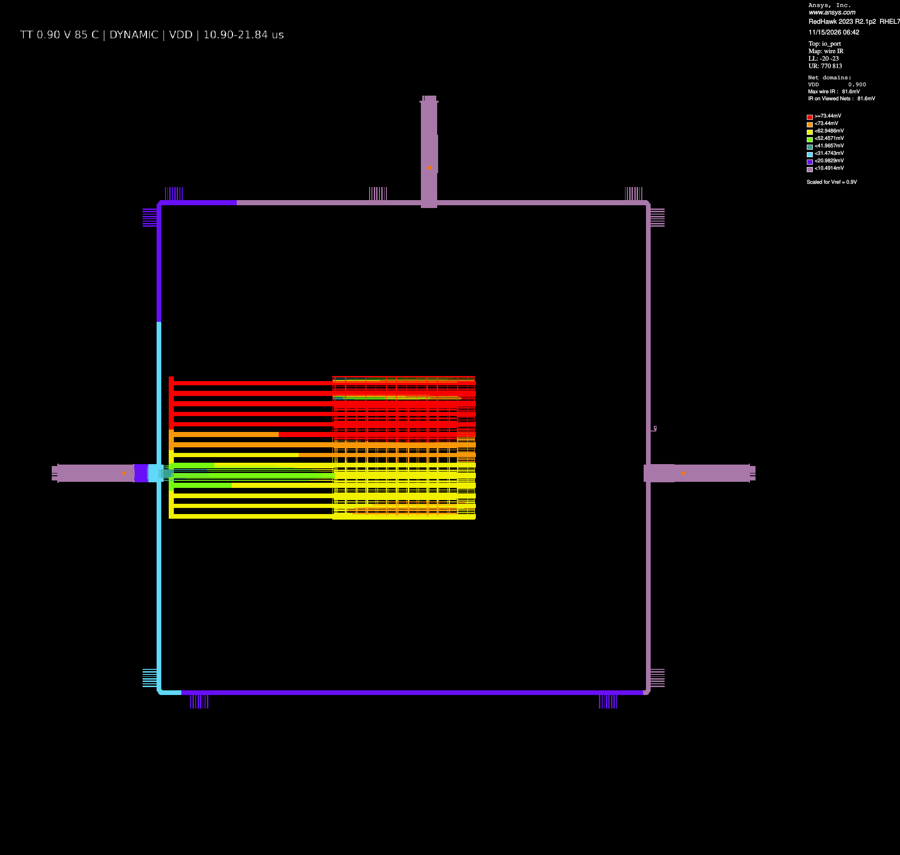
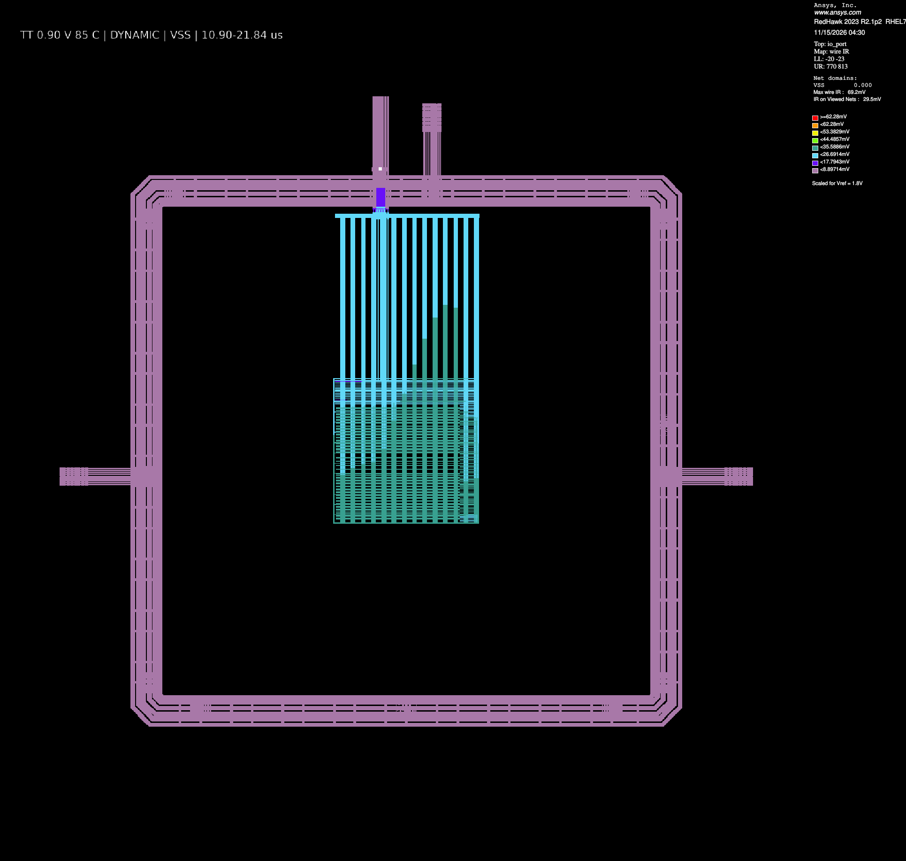
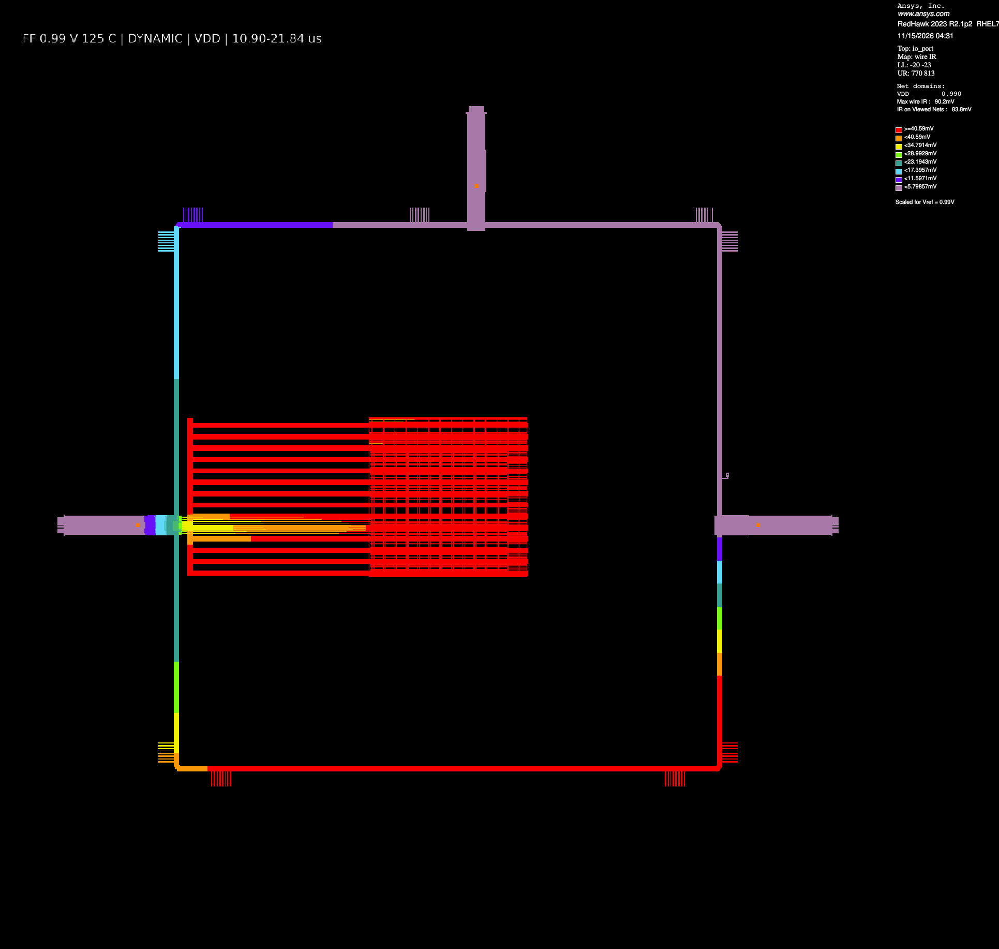
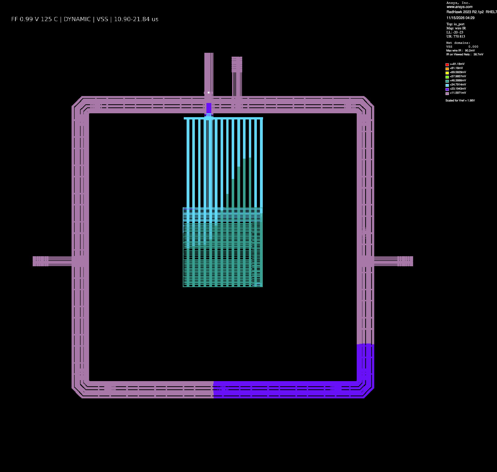
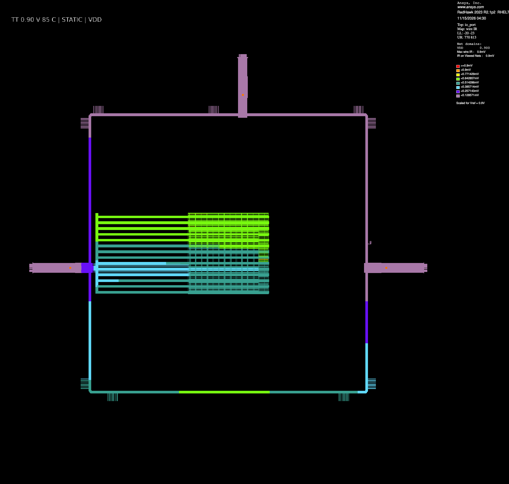
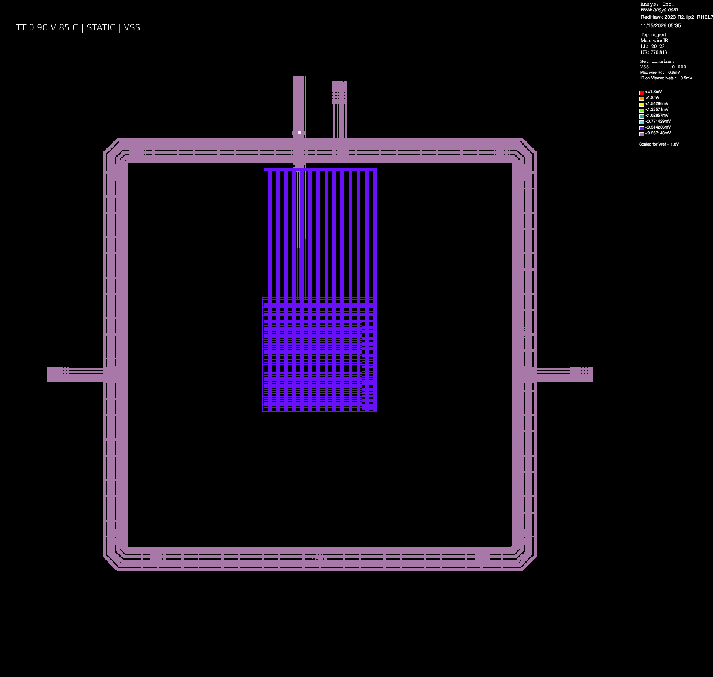
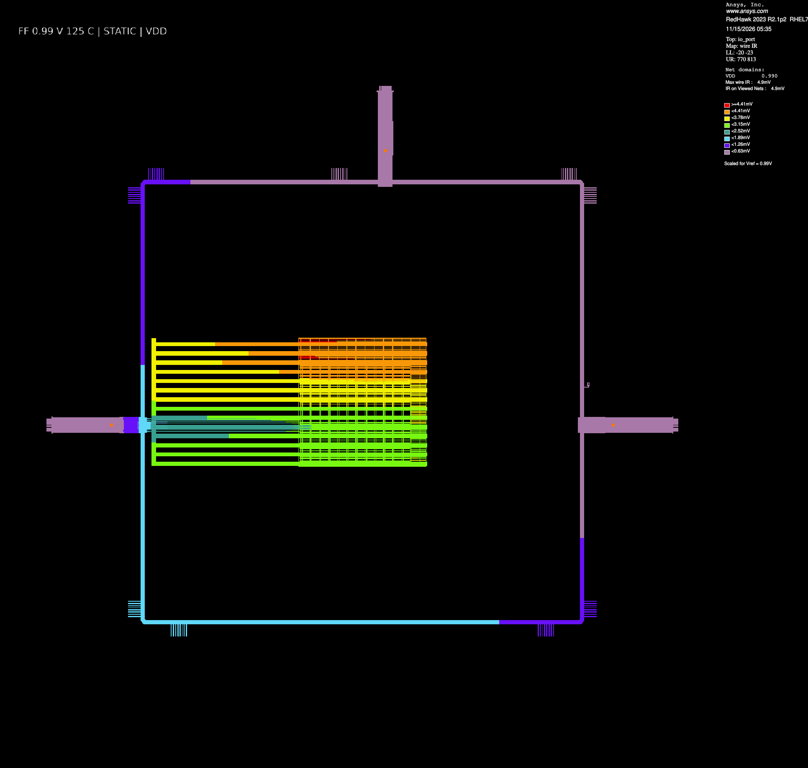
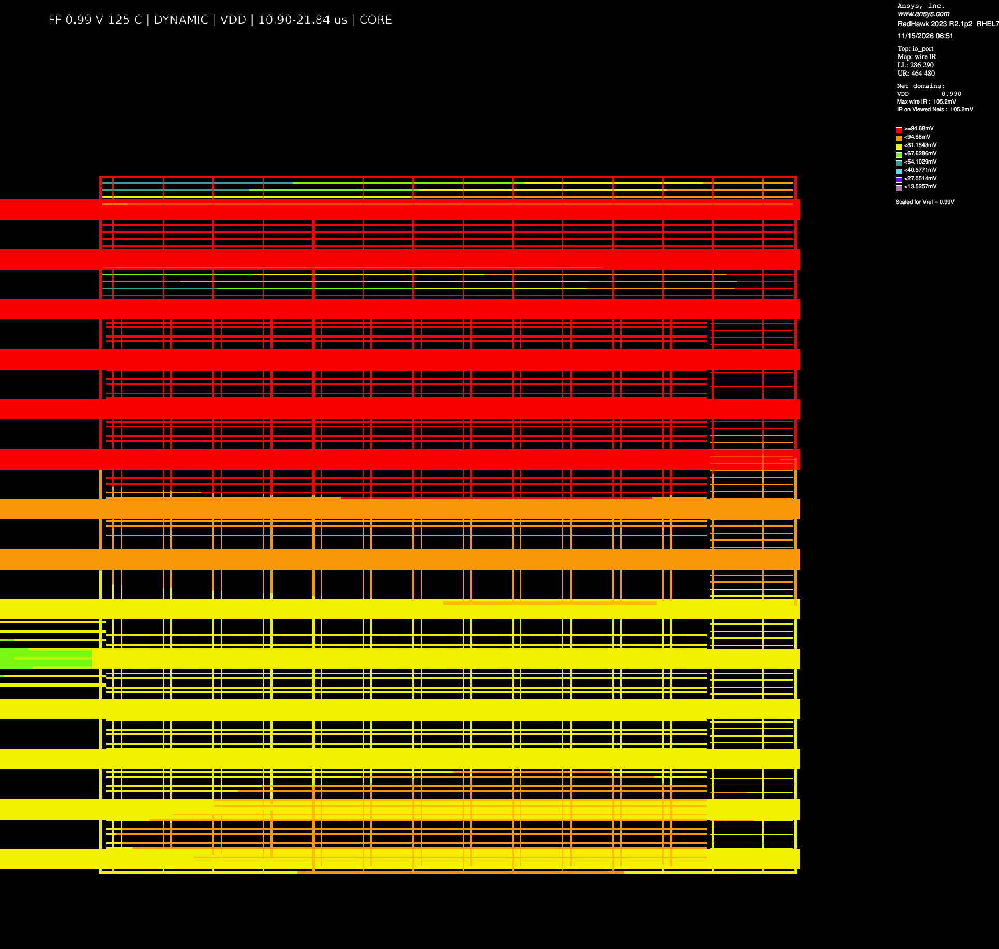
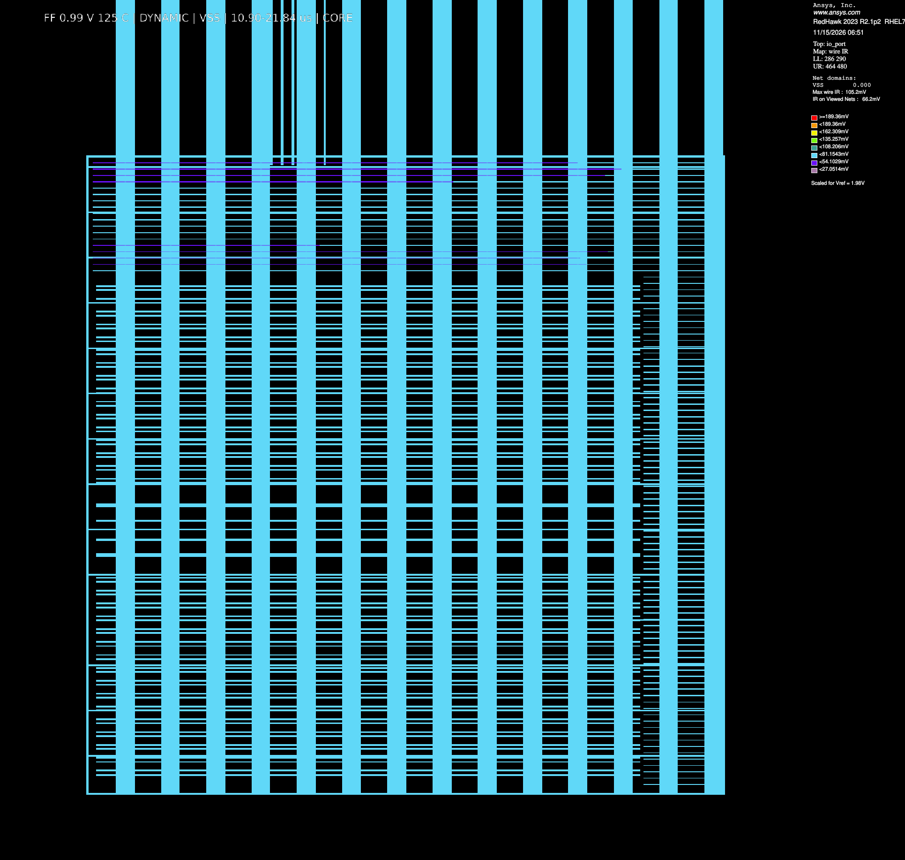

# io_port：带 IO pad 的 N28 RTL2GDS 项目

`io_port` 是一个串行接口控制的 GPIO 与 SRAM 设计，采用 TSMC 28HPC+ 工艺。工程覆盖 RTL 仿真、综合、DFT、布局布线、GDS 导出和物理验证，包含完整的 IO 环、bond pad、SRAM 宏和外围逻辑。

## 最终版图


[查看原图](images/rtl2gds/io_port_sram_full.png)

| 项目 | 参数 |
| --- | --- |
| 工艺 | TSMC 28HPC+，7-track 标准单元 |
| 金属栈 | 9M 4X2Y2R |
| Die | 750×750 µm |
| Core | 137.9×137.9 µm |
| Floorplan 面积利用率（SRAM＋标准单元） | 74.66% |
| FC 标准单元利用率（扣除宏及 keepout） | 13.51% |
| SRAM | 1024×32 位（4 KiB），独立硬宏 |
| 信号 IO / 电源与地 IO | 25 / 14 |
| Bond pad | 39 |
| Corner | 4 |
| IO 节距 | 50 µm |
| 扫描链 | 1 条，167 bits；不包含 SRAM 阵列 |

GPIO 电路采用 7lm 视图，搭配 9M 4X2Y2R bond pad。39 个 IO 均衡分布到四边，分别为 10、10、10、9 个；核心电源 pad 放在对应边的中部，以对齐缩小后的 core。相比此前 SRAM 版的 800×800 µm，die 面积缩小约 12.1%。

core 独立缩紧，目标是 SRAM 与标准单元合计占 core 约 75%。这一比例包含 SRAM，与 FC 扣除宏和 keepout 后报告的标准单元利用率不同。本版 floorplan 实测分别为 **74.66%** 和 **13.51%**；后续 CTS、布线修复与填充会改变单元面积。


SRAM 由 `model.f` 指定，脚本自动接入对应的逻辑和物理库视图。FC 使用 ML 宏布局，自动比较候选的拥塞与时序并选择位置。当前设计没有 SRAM MBIST。

<details>
<summary>查看布线与焊盘分布</summary>

### M1–M9 布线（隐藏填充层）


供电网新增 14 条 M8 VDD 横向线和 14 条 M9 VSS 纵向线，线宽 4 µm、节距 10 µm。pad 接入段使用 8 µm 宽线，并通过分布式过孔接入核心区原有电网。

完整工程的供电参数集中在 `pr_env/scripts/pdk/tsmc28hpcplus.tcl`：`IO_UPPER_GRID_WIDTH=4.0`、`IO_UPPER_GRID_PITCH=10.0`、`IO_PAD_ACCESS_WIDTH=8.0`；局部指状线和原有馈线分别由 `IO_VSS_FINGER_WIDTH=1.6`、`IO_CORE_FEED_WIDTH=0.4` 控制，单位均为 µm。位置和条数由脚本生成，线宽仍需结合新项目的 IR/EM 检查选择。

### 焊盘与开口


</details>

## 设计功能

50 MHz 串行接口控制 8 位 GPIO 输入、8 位 GPIO 输出和 4 KiB 缓存。每帧 56 位，按 MSB first 传输：

```text
{opcode[7:0], address[15:0], data[31:0]}
```

上一条命令的 32 位响应在下一帧前 32 位返回。未满 56 位便释放 CS 的帧会被丢弃。低有效异步复位清除控制器和 GPIO，缓存需要先写后读。

| Opcode | 功能 |
| --- | --- |
| `01` | 写一个 32 位缓存字 |
| `02` | 读一个缓存字，地址 0–1023 |
| `03` | 写 GPIO 输出 |
| `04` | 读 GPIO 输入 |
| `05` | 读有效写入数据的累计 XOR 校验值 |

RTL 仿真覆盖 SRAM 全地址读写、GPIO、校验值、非法地址、半帧和复位保持。SRAM 的内容不随控制器复位清空。

## 运行方法

以下命令用于完整工程，需要配置相应 EDA 工具和工艺库。仓库中的 [rtl2gds_small](../rtl2gds_small/README.md) 为功能削减版。

在 `pr_env/scripts/utilities/pr_user_setting.template.tcl` 中开启 IO pad：

```tcl
set IO_PAD 1
set IO_PAD_COMPACT_CORE 1
set IO_PAD_CORE_UTILIZATION 0.75
```

```bash
# 功能仿真
bash DESIGN/io_port/run_sim.sh

# 完整 RTL2GDS 流程
bash DESIGN/io_port/run_rtl2gds.sh
```

也可以按阶段运行：

```bash
make -C be_env run_fc_syn run_dft_insert b=io_port
make -C pr_env pnr_all b=io_port
make -C pr_env physical_signoff_all b=io_port
```

已有 GDS 时，使用 `make -C pr_env physical_checks_all b=io_port` 重新执行物理检查。开启 `IO_PAD` 时 DRC 使用 fullchip 范围，关闭时使用 block 范围。

最终文件为 `pr_env/io_port/results/signoff/io_port.pnr.dummy.gds`，顶层为 `merge_io_port`。

## 验证结果

| 检查 | 本版结果 |
| --- | --- |
| FC 布线、PG 连通性与内部 LVS | 零违例 |
| Formality | 332 个比较点全部通过 |
| Calibre 填充前 / 填充后 LVS | 均为 `CORRECT` |
| DRC / ERC | 保留剩余违例，按项目 waiver 记录；ERC 为 246 条层级结果 |
| Antenna | 通过 |
| 功能 SDF 回标 | 四个工艺角全部通过，开启时序检查 |
| 布线后扫描回放 | 每角 100 patterns，四角全部通过，开启时序检查 |
| PrimeTime | 12 场景：setup 0、hold 2、最大转换时间 0、最大电容 3 项违例；约束与检查覆盖尚未全部通过 |
| RedHawk 静态 IR | TT、FF 均通过；FF 的 VDD 压降 4.9 mV、VSS 地弹 2.9 mV |
| RedHawk 动态 IR | TT、FF 均通过；核心域最坏 VDD 压降 8.46%、VSS 地弹 3.91% |
| GDS 层级 | 无未解析引用 |

RedHawk 现在使用标准单元 APL 和 IO/SRAM 的原厂 Liberty。电源 pad 的内部导通结构从现有 GDS 抽取，855 个有功耗的实例均已接入电网。当前分析 0.9 V / 85°C 的 TT 角和 0.99 V / 125°C 的 FF 角，互连均使用 `RCworst_T`。另两个原定分析角（0.8 V、0.88 V）缺少匹配的 SRAM 功耗视图；SS 低压高温的时序库已有，但缺少标准单元 SS 角 APL。

动态分析覆盖 10.90–21.84 µs，两个角的信号网和输入活动覆盖率均为 100%。当前联合门限为：同一供电域的 VDD 压降与 VSS 地弹之和，静态不超过额定电压的 5%，动态不超过 15%。核心域与 IO 域分别计算，两角均通过。采用各自最坏值相加作为保守上界，不表示两个峰值同时发生。

供电网加宽后的核心域结果如下，单位为 mV。FF 动态 VDD 压降由 223.5 降到 83.8，VSS 地弹由 348.2 降到 38.7。

| 工艺角 | 静态 VDD 压降 | 静态 VSS 地弹 | 动态 VDD 压降 | 动态 VSS 地弹 |
| --- | ---: | ---: | ---: | ---: |
| TT，0.9 V，85°C | 0.90 | 0.51 | 67.14 | 29.53 |
| FF，0.99 V，125°C | 4.90 | 2.90 | 83.80 | 38.68 |

核心域联合损失：TT 静态 **0.157%**、动态 **10.74%**；FF 静态 **0.788%**、动态 **12.37%**。这些结果也通过了之前的独立压降 / 地弹门限。

### RedHawk 压降图

下图直接从本次完成的 RedHawk 数据库导出，保留完整供电网和原生色标。动态图显示整个 10.90–21.84 µs 窗口的节点最坏值，各节点的峰值不一定同时发生。图例的 `IR on Viewed Nets` 是当前所选电源网的最大值；`Max wire IR` 是全设计最大值。色标单位为 mV、范围由工具自动设置，跨图比较以数值为准。红色表示色标的高值区，并不直接代表超过联合门限。

<details>
<summary>动态 IR：TT / FF，VDD / VSS 全图</summary>

| 工艺角 | VDD 压降 | VSS 地弹 |
| --- | --- | --- |
| TT，0.9 V，85°C |  |  |
| FF，0.99 V，125°C |  |  |

</details>

<details>
<summary>静态 IR：TT / FF，VDD / VSS 全图</summary>

| 工艺角 | VDD 压降 | VSS 地弹 |
| --- | --- | --- |
| TT，0.9 V，85°C |  |  |
| FF，0.99 V，125°C |  |  |

</details>

<details>
<summary>FF 动态核心区放大图</summary>

| VDD 压降 | VSS 地弹 |
| --- | --- |
|  |  |

</details>

本次为芯片级 IR 分析。标准单元功耗使用原厂 APL，IO/SRAM 使用原厂 Liberty，两角复用同一份 FF SDF 回标波形。SRAM 电流波形由 RedHawk 的 LIB2AVM 生成，有效电容采用工具默认估算。本次未运行 EM 检查。

部分 IO 接收支路仍有查表外推警告：当前 RedHawk 使用的输入转换时间为 100 ps，低于该支路功耗表的下限；日志中的负载为 0，辅助结构库的标准单元输入电容也为 0。这是当前流程的输入适配问题，后续需接入实际的信号负载与转换时间。

这版已完成面积优化和物理实现，但还不是全部 signoff 通过的状态。DRC/ERC 的项目 waiver 不包含时序违例；扫描回放通过也不代表 SRAM 阵列已有制造测试覆盖。当前未加入机械 seal-ring。

[本版参数与检查摘要](evidence/2026-11-15-io-port-sram-summary.json)

## 更多流程案例

[早期 SPI 项目](RTL2GDS_SPI_2026-09.md) 包含十二场景时序、205 patterns 扫描回放、四角 IR 和联合 ECO 记录。另见[流程截图](RTL2GDS_ARCHIVE_2026-09-04.md)和[早期 DOCX](RTL2GDS.docx)。
