# RTL2GDS 各阶段截图

这组截图展示综合、DFT、布局布线、形式验证、时序分析和物理验证的工具界面。最新的 GDS、十二场景 GUI、项目亮点与命令说明见 [RTL2GDS 全流程](RTL2GDS.md)。

## 综合 QoR

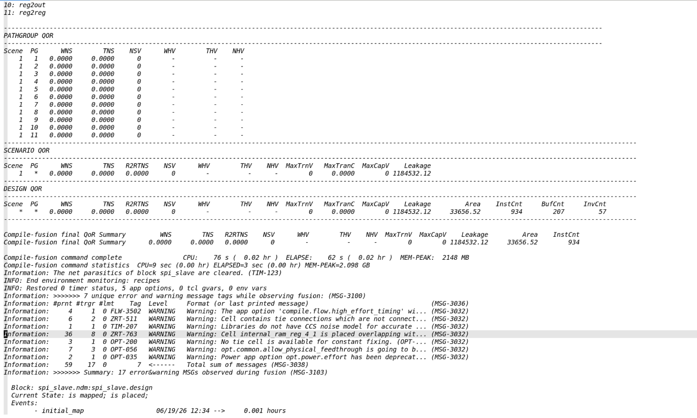

## DFT / ATPG

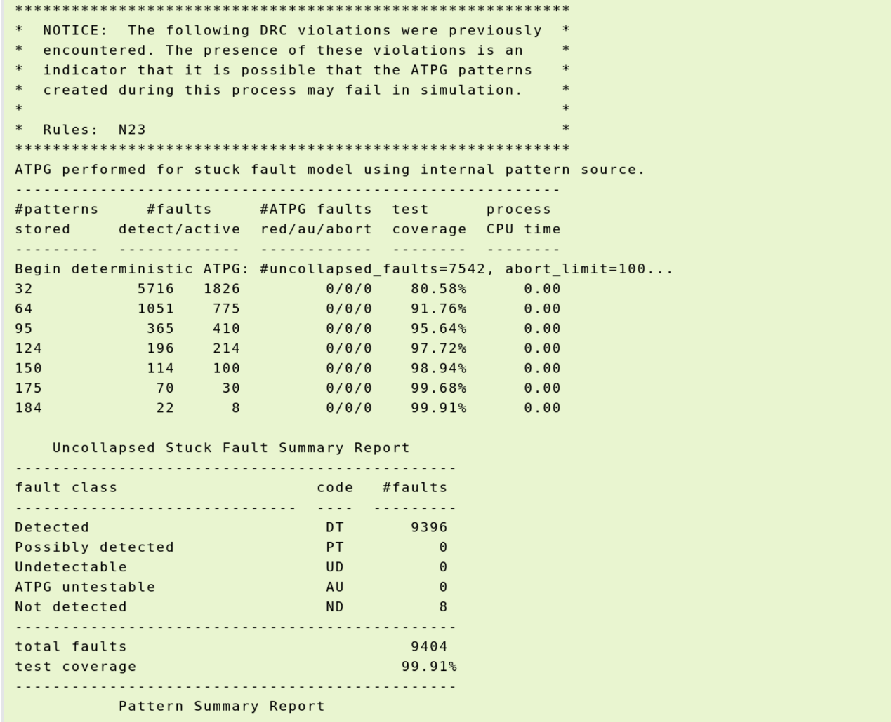

## 前端交付物

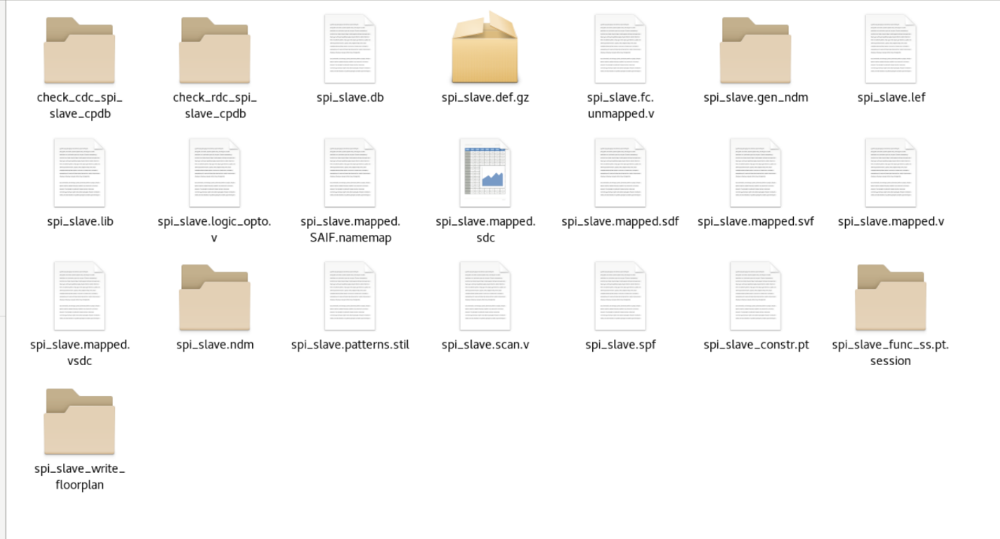

## 布局布线交付物

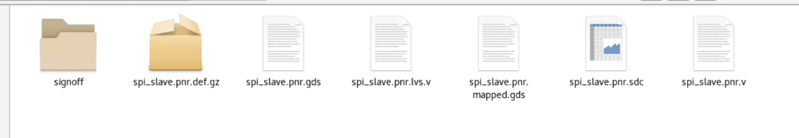

## Formality 等价验证

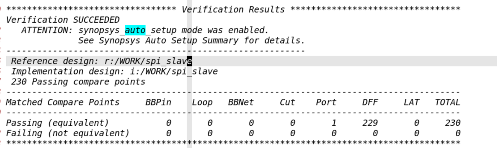

## 签核产物

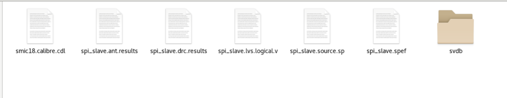

## GDS 视图

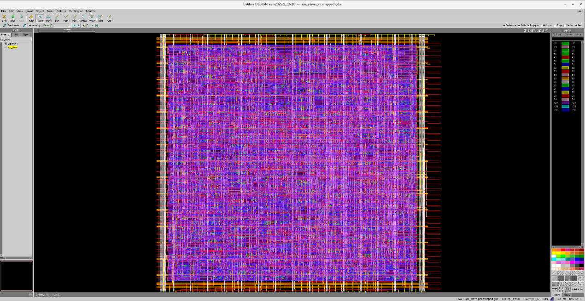

## PrimeTime 分析界面

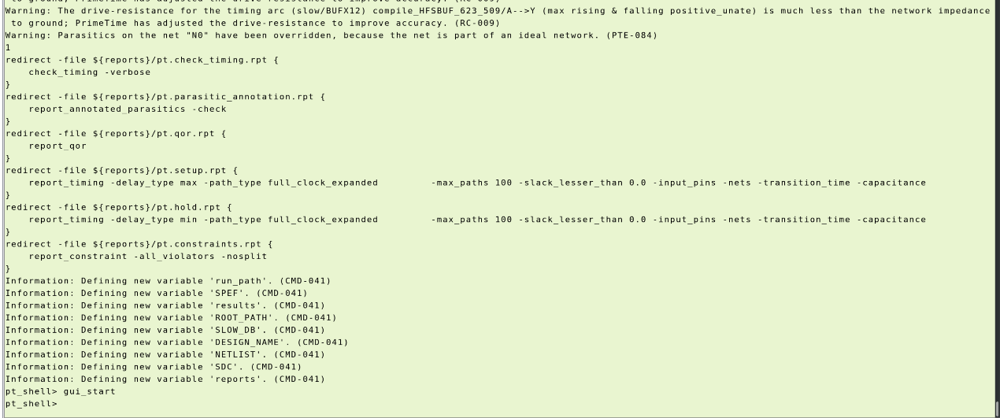

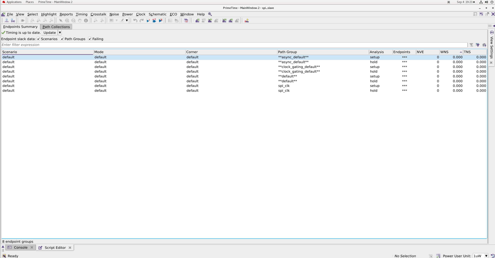

## RedHawk IR 视图

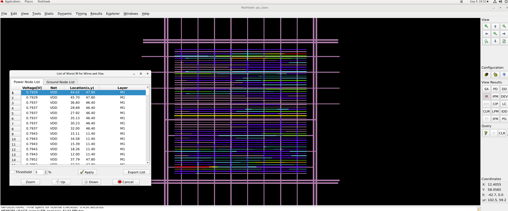

## Calibre RVE

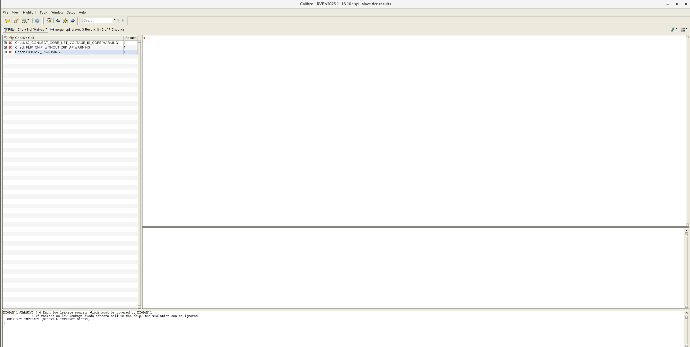

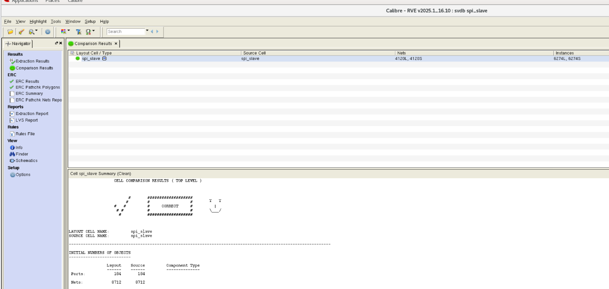

## TI SAR ADC

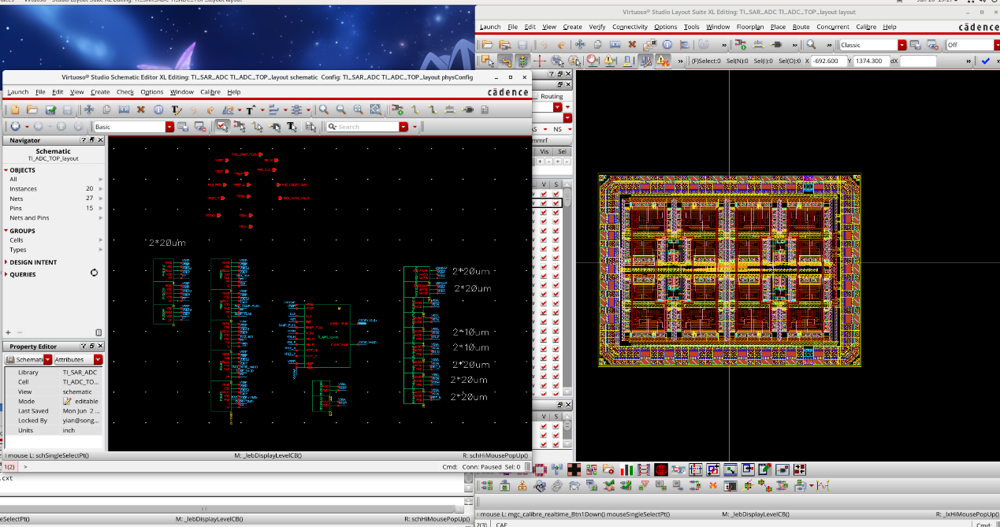

本页保存 2026-09-04 整理的阶段截图；最新运行数据集中列于[主文档](RTL2GDS.md#1-先看结果)。原始图文另见 [DOCX 存档](RTL2GDS.docx)。
